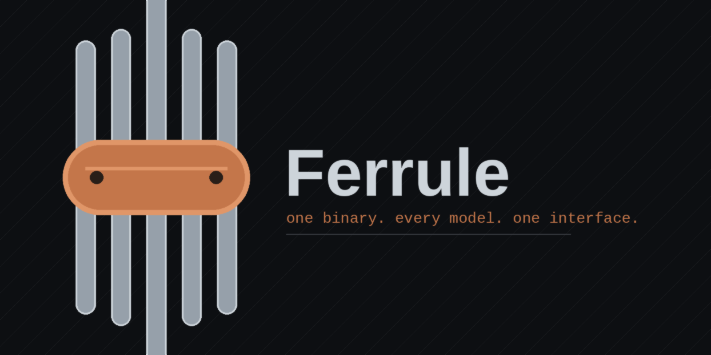

<p align="center">
  
</p>

# Ferrule

A portable, memory-efficient AI agent runtime in Rust — one static binary you
can deploy anywhere, with per-model harness profiles so every model is driven
the way it was trained to be driven.

Design rationale and research: see `docs/research-report.md`. Current status
and roadmap: see `PLAN.md`.

## Why

The harness, not the model, is the performance lever. Same model, different
harness: 13.3% → 38.3% on ARC-AGI-3, with ~6× fewer output tokens (OpenAI,
2026). Ferrule is built around that fact:

- **Harness profiles per model** (`HarnessProfile`): context window, compaction
  threshold (~70–75%, not 95%), reasoning retention, system-prompt dialect.
  Kimi K2's interleaved thinking is preserved across turns; generic endpoints
  get a conservative profile.
- **Structured compaction** with checklist templates + deterministic tool-result
  dedup (free 15–30% context savings) before any tokens are spent summarizing.
- **OpenAI-compatible driver** covers Kimi, OpenAI, DeepSeek, OpenRouter,
  Groq, Ollama, llama.cpp, vLLM out of the box.
- **SQLite hybrid memory** (FTS5 BM25 + 7-day time decay, token-budgeted
  recall) in a single file you can read and back up.
- **Append-only JSONL transcripts** per session: resumable, forkable, auditable.
- **Workspace-scoped tools** with path-escape rejection, shell deny-list,
  output capping, and hard timeouts.
- **Context baseline**: `AGENTS.md`/`CLAUDE.md`/`GEMINI.md` auto-loaded into
  the system prefix — living documentation written *for* the agent.
- **Agent diary**: `write_todos` + `log_diary` tools persist the trajectory to
  `.ferrule/` so you debug trajectories, not bugs.
- **Validation policy**: `[agent] verify_command` makes the build system the
  truth — pass or fix forward.
- Typed lifecycle events (`RunStarted → ContextReady → Tooling → Compacted →
  RunFinished`) streamed over a channel — observability is structural.

## Layout

```
crates/
  ferrule-core       loop, provider trait, harness profiles, transcripts, events
  ferrule-providers  OpenAI-compatible driver (Kimi/OpenAI/DeepSeek/local…)
  ferrule-tools      fs / shell / web_fetch, workspace-scoped and output-capped
  ferrule-memory     SQLite + FTS5 memory with time decay
  ferrule-cli        the `ferrule` binary (run / chat / memory / config)
```

## Quick start

```bash
cargo build --release

./target/release/ferrule config init        # writes ferrule.toml
export MOONSHOT_API_KEY=sk-...                # or OPENAI_API_KEY etc.
./target/release/ferrule run "list the files here and summarize the project"
./target/release/ferrule chat               # interactive session
./target/release/ferrule memory add "prefers terse answers" --tags pref
./target/release/ferrule memory search "answers style"
```

Config is `ferrule.toml` in the working directory or
`~/.config/ferrule/config.toml`. API keys always come from env vars.

## Tests

```bash
cargo test --workspace
```

Covers the loop (tool dispatch, error recovery, reasoning retention), the
provider wire format against a mock HTTP server, workspace-escape rejection,
the shell deny-list, and memory recall/budgeting.

## Roadmap

- [ ] Codex Responses-API driver (retained reasoning, `/responses/compact`)
- [ ] Claude driver: `claude -p` subprocess mode (subscription-compliant) +
      native Messages API with cache breakpoints
- [ ] MCP client (rmcp) + skills loaded on demand
- [ ] Subagents: Architect/Planner/Implementer/Verifier-style spawn with
      isolated contexts and summary-only return
- [ ] Tree-sitter semantic code search via MCP
- [ ] Gateway daemon: session lanes, cron/heartbeat, channels (Telegram…)
- [ ] Vector recall (local embeddings) merged with BM25
- [ ] OS sandbox backends (Landlock / Bubblewrap / Seatbelt), WASM tool plugins
- [ ] Streaming SSE responses
