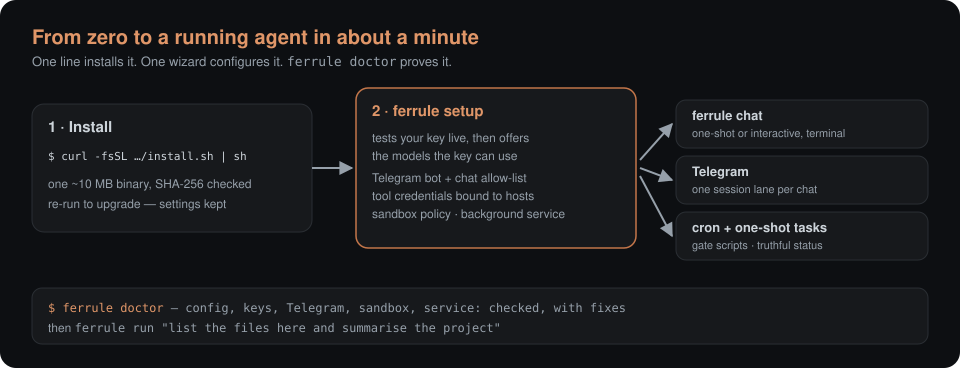
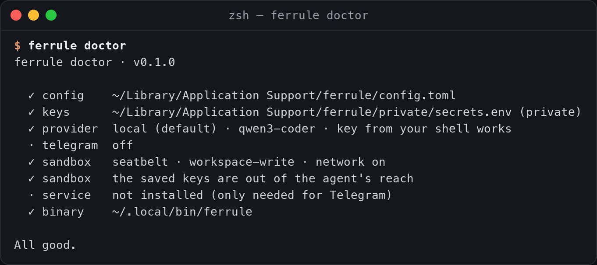
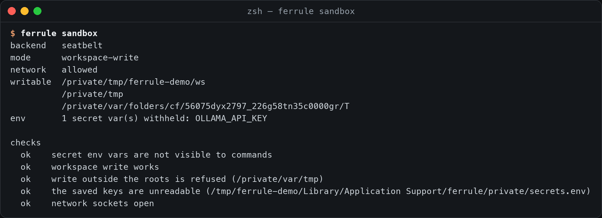
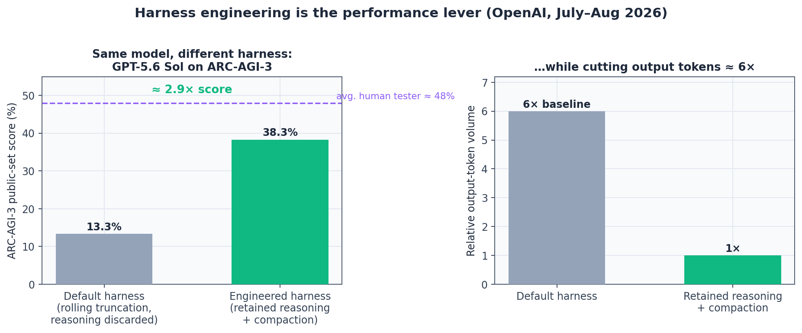
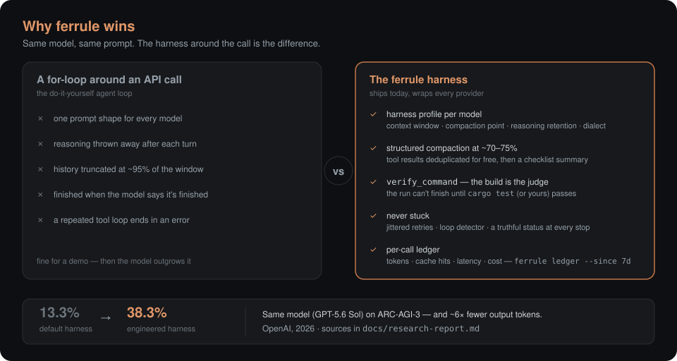
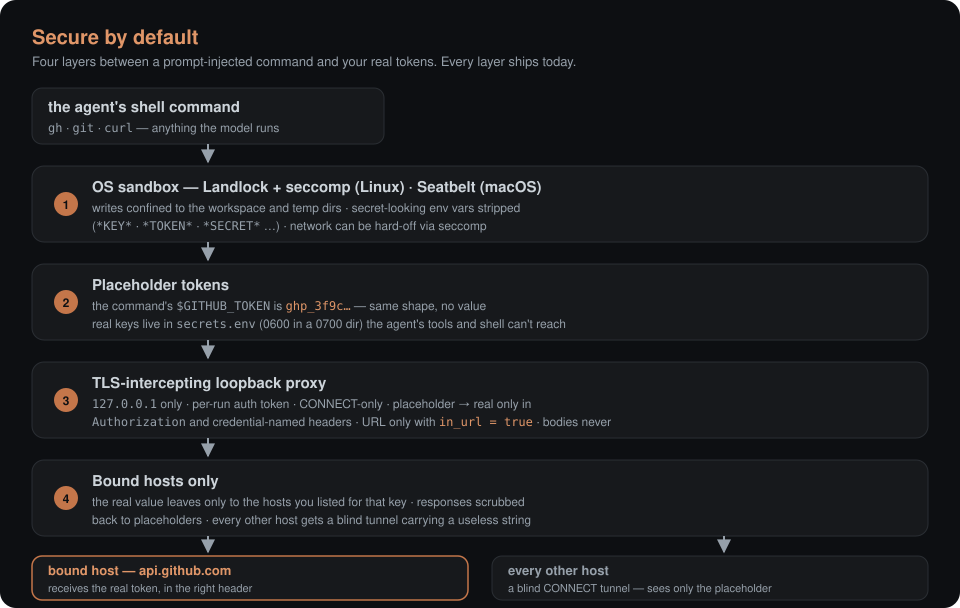
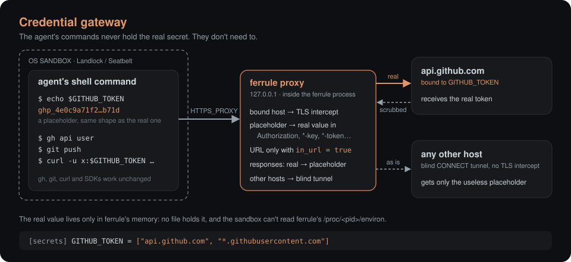
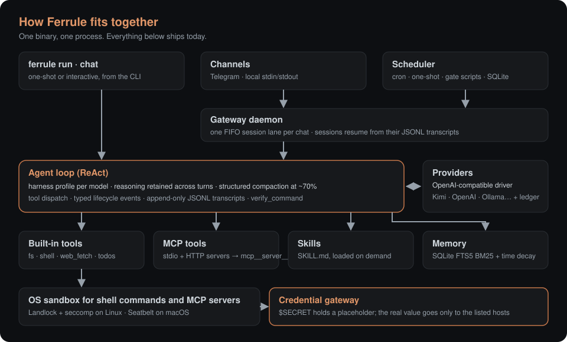
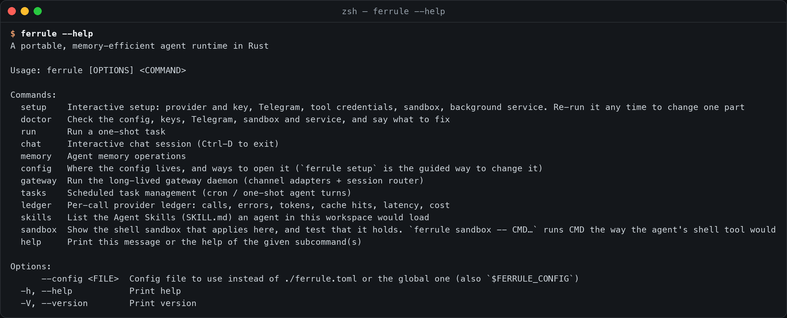
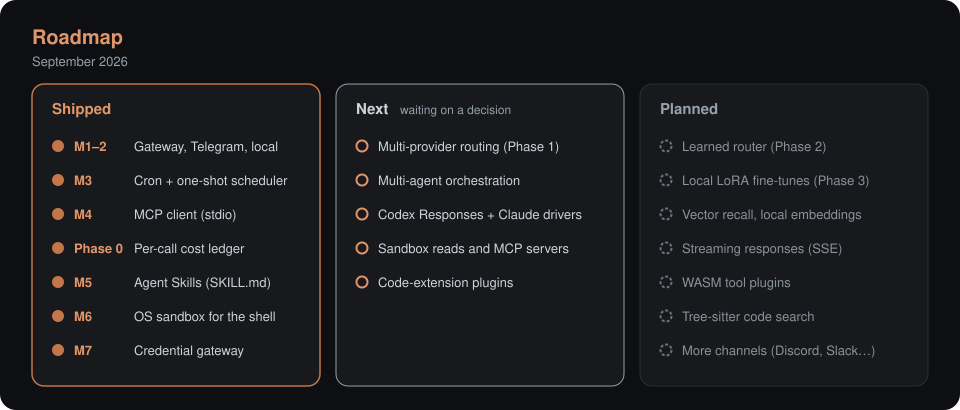

<p align="center">
  
</p>

<p align="center">
  <b>An AI agent runtime in one small Rust binary.</b><br>
  Chat, schedule, sandbox and hand out credentials without handing over the secret.
</p>

<p align="center">
  <a href="https://github.com/maximarhipkin/ferrule/actions/workflows/ci.yml"></a>
  <a href="https://github.com/maximarhipkin/ferrule/releases"></a>
  
  
  
</p>

<p align="center">
  <a href="#60-seconds-to-your-first-agent-run">60-second start</a> ·
  <a href="#why-ferrule-wins">Why ferrule wins</a> ·
  <a href="#secure-by-default">Secure by default</a> ·
  <a href="#install">Install</a> ·
  <a href="#configuration">Configuration</a> ·
  <a href="#credential-gateway">Credential gateway</a> ·
  <a href="#roadmap">Roadmap</a> ·
  <a href="PLAN.md">PLAN.md</a>
</p>

---

## The pitch

Ferrule runs a coding and operations agent against any OpenAI-compatible
model — from the terminal, from Telegram, or on a cron schedule. It's one
binary of about 10 MB with nothing to install beside it (the Linux builds
are fully static): `ferrule --version` starts in about 4 ms, and the idle
gateway daemon uses about 9 MB of RAM. All state lives in files you can
read: SQLite for memory and tasks, JSONL for transcripts and the cost
ledger.

Three reasons to pick ferrule over a for-loop around an API call:

1. **The harness is the performance lever — ferrule is the harness.** In
   OpenAI's 2026 ARC-AGI-3 runs, the *same* model scored 13.3% with a
   default harness and 38.3% with an engineered one, on ~6× fewer output
   tokens. Ferrule is built around that result: per-model harness profiles,
   structured compaction, a verifier that won't let the agent stop early,
   and a loop that never gets stuck. [The evidence.](#why-ferrule-wins)
2. **Safe by default, not by configuration.** Every shell command the
   agent runs sits inside an OS sandbox, and API tokens reach commands only
   as same-shaped placeholders — a local proxy swaps in the real value on
   the wire, only for the hosts you allow. [The layers.](#secure-by-default)
3. **The easiest runtime to actually run.** One-line install, a setup
   wizard that tests your keys live and offers the models they can use, and
   `ferrule doctor` to re-check everything later and say what to fix.
   [See for yourself.](#60-seconds-to-your-first-agent-run)

## 60 seconds to your first agent run

<p align="center">
  
</p>

```bash
curl -fsSL https://raw.githubusercontent.com/maximarhipkin/ferrule/main/install.sh | sh
ferrule setup        # provider + key (tested live), Telegram, credentials, sandbox, service
ferrule run "list the files here and summarise the project"
```

On Windows it's `irm … install.ps1 | iex`.

And this is what you get: real output, unedited (macOS build; on Linux the
sandbox rows read Landlock + seccomp instead of Seatbelt). Here the
provider is a local model, so no cloud key was involved:

<table align="center">
  <tr>
    <td></td>
    <td></td>
  </tr>
</table>

`ferrule doctor` checks the config, the saved keys' file permissions, the
provider key **live**, Telegram, the sandbox, the credential-proxy path,
MCP servers, an installed Chrome and the background service — and each red
line comes with the exact fix. `ferrule sandbox` doesn't just print the
policy, it runs the promises: write inside the workspace works, write
outside is refused, the saved keys are unreadable, secret env vars are
withheld.

## Why ferrule wins

The model you wrap matters less than how you wrap it. In OpenAI's 2026
ARC-AGI-3 investigation, the *same* model scored **13.3%** with a default
harness — reasoning discarded after every action, history silently
truncated at the limit — and **38.3%** with an engineered one (retained
reasoning plus compaction), while output-token use dropped ~6×. Nothing
about the model changed.

<p align="center">
  
</p>

Ferrule is that engineered harness, for every model it drives:

<p align="center">
  
</p>

- **A harness profile per model.** Context window, when to compact (at
  about 70–75% of the window, not 95%), whether reasoning is carried across
  turns, and the system-prompt dialect. Kimi K2's interleaved thinking is
  kept across turns, and an endpoint ferrule doesn't know gets a
  conservative profile.
- **Structured compaction.** Tool results are deduplicated for free before
  a checklist summary spends any tokens — and your original request is
  pinned into the summary verbatim, so long runs don't drift off-task.
- **The build is the judge.** With `[agent] verify_command = "cargo test"`,
  a run that changed files can't finish until the command passes; a failure
  goes back to the model with the tail of the output.
- **Never stuck.** Transient provider errors are retried with capped,
  jittered backoff (honouring `Retry-After`). A stuck detector — the same
  call 4×, the same failure 3×, two calls ping-ponging 6× — warns the model
  once, then stops the run. Every stop ends in a truthful status (what's
  done, what's left, what blocks it), never a bare error.
- **A ledger for every call.** Tokens, cache hits, latency, errors and
  cost, per provider call: `ferrule ledger --since 7d`.

The evidence and the design behind it:
[`docs/research-report.md`](docs/research-report.md).

## Secure by default

An agent that can run shell commands and hold API tokens is one prompt
injection away from posting your keys anywhere. Ferrule puts four layers
between the model and your real tokens — all on by default:

<p align="center">
  
</p>

1. **An OS sandbox around every shell command and stdio MCP server** —
   Landlock + seccomp on Linux, Seatbelt on macOS. Writes are confined to
   the workspace, secret-looking env vars (`*KEY*`, `*TOKEN*`, `*SECRET*`…)
   are stripped, and the network can be hard-off via seccomp. (Native
   Windows has no sandbox yet — [use WSL2](#windows).)
2. **Placeholders, not tokens.** Commands see `$GITHUB_TOKEN` as a
   same-shaped placeholder. Saved keys live in `secrets.env` (0600, in a
   0700 directory) that the agent's file tools and sandboxed shell can't
   reach.
3. **A TLS-intercepting loopback proxy.** Per-run auth token, CONNECT-only.
   It swaps the placeholder for the real value on the wire, and only in
   `Authorization` or credential-named headers — the URL only with explicit
   `in_url = true`, bodies never.
4. **Bound hosts only.** The real value leaves the machine exclusively to
   the hosts you listed for that key. Responses are scrubbed back to
   placeholders; every other host gets a blind tunnel carrying a useless
   string.

<p align="center">
  
</p>

The details, the threat model and the honest list of limits:
[Sandbox](#sandbox) and [Credential gateway](#credential-gateway) below,
and [`docs/research-credential-gateway.md`](docs/research-credential-gateway.md).

## What's inside

<p align="center">
  
</p>

| | |
|---|---|
| **Agent loop** | ReAct loop with typed lifecycle events, resumable JSONL transcripts, compaction, and reasoning retention. |
| **Providers & models** | One OpenAI-compatible driver: OpenAI, Anthropic, Google Gemini, Kimi, DeepSeek, OpenRouter, Groq, Ollama, llama.cpp, vLLM. Several models live at once, a default, a model per chat, task or sub-agent, `/model` from Telegram, an optional fallback on outage, and the ledger records the model that actually answered ([`docs/models.md`](docs/models.md)). |
| **Connections** | The agent connects Jira and Confluence, Gmail, Drive, Notion, Linear, Attio and GitHub by itself. It asks, you tap one Telegram button, and the OAuth code (always PKCE) comes back through your own small Cloudflare Worker relay, a `cloudflared` quick tunnel or a pasted URL, so no inbound port. Tokens are sealed on disk, refreshed per request and never shown to the model. Read-only by default; writes ask you first ([`docs/m20-connections.md`](docs/m20-connections.md)). |
| **Tools** | File read, write and list (workspace-scoped), `shell`, `web_fetch`, `write_todos` and `log_diary`, `remember` and `recall`. |
| **MCP** | stdio and Streamable HTTP MCP servers. stdio servers run inside the OS sandbox; remote servers' HTTPS goes through the credential proxy. Tools register as `mcp__<server>__<tool>`. `ferrule mcp add` tests and scans a server, then adds it to the running daemon without a restart. |
| **Browser** | agent-browser's MCP server on your installed Chrome, in the sandbox and behind the proxy ([`docs/browser.md`](docs/browser.md)). |
| **Sub-agents** | `spawn_agent` / `wait` / `resume` / `close`: planner, worker and verifier roles with isolated contexts, a worktree per child, roles on their own providers, tree limits and a shared budget ([`docs/agents.md`](docs/agents.md)). |
| **Self-extension** | The agent installs vetted skills and MCP servers for itself: a poisoning scan, version pinning and an allow-list ([`docs/m13-self-extension.md`](docs/m13-self-extension.md)). |
| **Skills** | Agent Skills (`SKILL.md` folders, Claude-compatible), loaded on demand. |
| **Memory** | One SQLite file: FTS5 BM25 with time decay and token-budgeted recall. `update_memory` supersedes a fact and `forget` deletes it; compaction keeps a ref to every large tool result, and `search_history` brings it back ([`docs/m15-memory.md`](docs/m15-memory.md)). |
| **Learning loop** | `ferrule learn run` (or a nightly task, off by default) turns failed runs into playbook lessons, kept only when the task passes twice with the lesson in the prompt ([`docs/m16-learning-loop.md`](docs/m16-learning-loop.md)). |
| **Gateway** | A long-running daemon with Telegram and local channels, one session lane per chat, resumed across restarts. Never silently deaf: 👀 on every message it accepts, `/status` and `/stop` answered mid-turn, a no-progress watchdog, `max_turn_minutes`, a systemd watchdog and an optional heartbeat ([`docs/m19b-reliability.md`](docs/m19b-reliability.md)). When it does go quiet it says why in Telegram: another program polling the same token (409), a webhook (removed at start), a voice note or photo it can't read, a model with no tool support, a rate limit with a countdown in `/status`. `ferrule doctor` catches a second gateway and `:free` models, and no log line carries the bot token ([`docs/m19c-live-fixes.md`](docs/m19c-live-fixes.md)). |
| **Dashboard** | One page for the whole app: health first, connections, models with an OpenRouter catalog, prices and recommendations, usage, tasks, logs, extensions and sub-agents. Send `/dashboard` and get a one-use 10-minute link; a `cloudflared` quick tunnel opens on demand and `/dashboard off` revokes it all. It never calls the model, so it works when every model is down ([`docs/dashboard.md`](docs/dashboard.md)). |
| **Scheduler** | Cron (with IANA timezone) and one-shot tasks, with gate scripts, no overlapping runs, and a truthful status per run. |
| **OS sandbox** | Every shell command and stdio MCP server runs under Landlock (+ seccomp) on Linux or Seatbelt on macOS. Writes are confined to the workspace, and secret env vars are stripped. Native Windows has no sandbox yet ([below](#windows)). |
| **Credential gateway** | Commands get a placeholder token. A local proxy swaps in the real one only for the hosts you allow. |
| **Ledger** | Every model call is logged: tokens, cache hits, latency, errors, cost. |
| **Trust & cost** | Token and dollar caps per run, per day and per scheduled task, with an 80% warning; a kill switch (`ferrule stop`, `/stop`, `/resume`); approvals for destructive actions; plan mode ([`docs/m19-trust-cost.md`](docs/m19-trust-cost.md)). |
| **Hooks** | Ten lifecycle events (SessionStart, PreToolUse, PostToolUse, Stop, PreCompact and more) with Claude Code's JSON payload and exit-code contract ([`docs/m18-hooks.md`](docs/m18-hooks.md)). |
| **Eval** | `ferrule eval run`: task suites through the real agent loop, graded by commands and LLM rubrics, with a naive-vs-engineered A/B on the same model ([`docs/eval.md`](docs/eval.md)). |
| **Context baseline** | `AGENTS.md`, `CLAUDE.md`, `GEMINI.md` or `ferrule.md` in the workspace goes into the system prompt. |

## Install

**Linux and macOS:**

```bash
curl -fsSL https://raw.githubusercontent.com/maximarhipkin/ferrule/main/install.sh | sh
```

**Windows** (PowerShell):

```powershell
irm https://raw.githubusercontent.com/maximarhipkin/ferrule/main/install.ps1 | iex
```

The script downloads the release for your machine, checks its SHA-256,
installs it and starts `ferrule setup`. Nothing to export, no file to edit.
Run it again to upgrade: your settings stay, and on Linux and macOS a
running background service is restarted on the new binary.

**Running 0.1.0 as a Telegram bot? Upgrade.** 0.1.0 can go silently deaf:
a dropped long-poll connection hangs forever while the process looks alive.
0.2.0 fixes that, and adds `/status` and `/stop` that answer even in the
middle of a turn, a watchdog message when a turn stops making progress, a
systemd watchdog for a wedged process and an optional outbound heartbeat
([`docs/m19b-reliability.md`](docs/m19b-reliability.md)). After the
upgrade, `ferrule doctor` tells you if your service unit predates the
watchdog and how to rewrite it.

| | Installs to | Prebuilt for |
|---|---|---|
| Linux | `~/.local/bin/ferrule` | x86-64, arm64 (static, any distro) |
| macOS | `~/.local/bin/ferrule` | Apple silicon, Intel |
| Windows | `%LOCALAPPDATA%\Programs\ferrule\ferrule.exe`, added to your PATH | x86-64 (ARM64 runs it under emulation) |

Both scripts read `FERRULE_VERSION` (a tag such as `v0.2.0`; default the
latest), `FERRULE_INSTALL_DIR` and `FERRULE_NO_SETUP=1` (install only).

### Setup

`ferrule setup` walks through everything, testing keys and tokens as you
enter them:

1. **Model provider**: OpenAI, Moonshot (Kimi), OpenRouter, DeepSeek,
   Anthropic, Ollama on this machine, or any OpenAI-compatible URL. Paste
   the key, pick a model from the ones the key can use.
2. **Telegram** (optional): paste the token from
   [@BotFather](https://t.me/BotFather), then message the bot. Your chat
   goes on the bot's allow-list; it ignores everyone else.
3. **Tool credentials** (optional): tokens the agent's commands may use,
   such as `GITHUB_TOKEN`, each bound to the hosts it's for (see the
   [credential gateway](#credential-gateway)).
4. **Sandbox**: the recommended policy, or your own.
5. **Background service**: the gateway as a systemd user service (Linux)
   or a launchd agent (macOS), started at login and restarted if it stops.
   Run as root on Linux (`sudo ferrule setup`, or `--system`), it's a
   system service instead, run as a `ferrule` user of its own (no login,
   no sudo) under `ProtectSystem=strict`/`ProtectHome=yes`, with config in
   `/etc/ferrule` and data and workspace in `/var/lib/ferrule`. The
   installer, as root, puts the binary in `/usr/local/bin` for it.

Run it again any time to change one part: it opens on a menu with what's
set now. Keys go into a private file (0600, in a directory the agent's
commands and file tools can't reach), never into the config.

```bash
ferrule doctor          # checks config, keys, Telegram, sandbox and service; says what to fix
ferrule config path     # where the config, the keys, the data and the service unit are
ferrule config edit     # open the config in $EDITOR, then check it still parses
ferrule config example  # every option, commented
```

### Windows

Native Windows has **no OS sandbox** in ferrule yet: shell commands the
agent runs have your own permissions. Saved keys still stay out of its file
tools and out of the commands' environment. For full isolation, run the
Linux build under [WSL2](https://learn.microsoft.com/windows/wsl/install)
(the `curl … | sh` line, inside WSL).

The agent's shell is Git Bash when [Git for Windows](https://gitforwindows.org)
is installed, else PowerShell, and the agent is told which one it has.
There's no background service on Windows yet; run `ferrule gateway` in a
terminal, or add it to Task Scheduler.

### Build from source

You need Rust 1.85 or newer ([rustup](https://rustup.rs)) and a C compiler
(`cc`/`clang`, or MSVC on Windows) for the bundled SQLite and `ring`. The
Linux sandbox needs kernel 5.13 or newer; on older kernels commands run
unsandboxed, or ferrule refuses to start if `[sandbox] require = true`.

```bash
git clone https://github.com/maximarhipkin/ferrule
cd ferrule
cargo install --locked --path crates/ferrule-cli   # puts `ferrule` in ~/.cargo/bin
ferrule setup
```

## Quick start

```bash
mkdir ~/ferrule-workspace && cd ~/ferrule-workspace
ferrule run "list the files here and summarise the project"
ferrule chat                         # interactive, Ctrl-D to exit
ferrule sandbox                      # what the shell sandbox allows here, tested live
```

The workspace is the directory the agent works in: its file tools stay
inside it, and sandboxed commands can write only there. Keep it apart from
ferrule's own data directory.

The full command surface, from the binary itself:

<p align="center">
  
</p>

| | Linux | macOS | Windows |
|---|---|---|---|
| Config | `~/.config/ferrule/config.toml` | `~/Library/Application Support/ferrule/config.toml` | `%APPDATA%\ferrule\config.toml` |
| Data | `~/.local/share/ferrule/` | `~/Library/Application Support/ferrule/` | `%LOCALAPPDATA%\ferrule\` |

A `ferrule.toml` in the current directory, `--config FILE` or
`$FERRULE_CONFIG` takes the place of the global config.

The data directory holds:

- `memory.db`
- `sessions/` (transcripts)
- `tasks.db`
- `ledger.jsonl`
- `proxy/` (the credential gateway's CA and seed)
- `private/secrets.env` (the keys `ferrule setup` saved)

## Configuration

`ferrule setup` covers the common settings. For the rest, `ferrule config
edit`; `ferrule config example` lists every option. A key can live in the
saved-keys file or in the environment, where `export NAME=…` wins. The
main options:

**A local model** (any OpenAI-compatible endpoint):

```toml
default_provider = "local"

[providers.local]
base_url = "http://localhost:11434/v1"   # Ollama
api_key_env = "OLLAMA_API_KEY"           # any non-empty value
model = "qwen3-coder"
profile = "generic"
```

Pick a provider per run with `--provider NAME`, or a model with
`--model REF`. `run`, `chat` and `gateway` also take `--workspace DIR` and
`--max-iterations N`.

**Several models** at once, with a default, aliases and a fallback:

```toml
[models]
default = "openai/gpt-5.2"             # wins over default_provider
fallback = ["deepseek"]                # off unless you list models

[models.aliases]
fast = "groq/llama-3.3-70b-versatile"
```

`ferrule model list | default | test | add | pin | fallback` from the
terminal, or `/model` from Telegram (owner only). A chat can be pinned to a
model (`/model use fast`), and so can a scheduled task (`ferrule tasks add
--model`) or a sub-agent. Details: [`docs/models.md`](docs/models.md).

**Telegram:**

```toml
[gateway]
telegram_token_env = "TELEGRAM_BOT_TOKEN"
telegram_allowed_chats = [123456789]   # everyone else is ignored
```

```bash
ferrule gateway          # long-polls Telegram; one session per chat
```

Anyone can find a bot and message it, so only the chats in
`telegram_allowed_chats` reach the agent. While the list is empty, the bot
answers each new chat once with its chat id and forwards nothing.

**Scheduled tasks** run inside `ferrule gateway`, so it has to be running:

```bash
ferrule tasks add morning-brief --kind cron --schedule "0 9 * * *" \
  --timezone Asia/Jerusalem --channel telegram --chat-id 123456789 \
  --prompt "Summarise yesterday's commits in this repo"
ferrule tasks add remind --kind once --schedule 2026-10-01T09:00:00+03:00 \
  --channel local --chat-id local --prompt "Remind me to renew the domain"
ferrule tasks list                    # ids, schedules, next run
ferrule tasks runs <ID>               # truthful status for every run
```

`--gate "script"` runs before the agent wakes. If it prints
`{"wakeAgent": false}`, the run is skipped at zero token cost.

**MCP servers** come in two shapes. A stdio server is spawned per its
`command`, and runs inside the same OS sandbox as the shell: it can write
the workspace, temp dirs and a state dir of its own, it always has the
network, and its environment is scrubbed of secrets. `sandbox = false`
opts out, and `ferrule doctor` flags it. A remote server speaks Streamable
HTTP over `url`, and its HTTPS goes through the credential proxy — a
`${VAR}` in a header arrives as the placeholder and is swapped only for
the hosts that secret is bound to:

```toml
[[mcp.servers]]                       # stdio, sandboxed
name = "fs"
command = "npx"
args = ["-y", "@modelcontextprotocol/server-filesystem", "/tmp"]

[[mcp.servers]]                       # Streamable HTTP, through the proxy
name = "remote"
url = "https://mcp.example.com/mcp"
headers = { Authorization = "Bearer ${REMOTE_MCP_TOKEN}" }
```

**Skills** are found in `.ferrule/skills`, `.agents/skills` or
`.claude/skills` in the workspace, and in `~/.agents/skills` or
`~/.claude/skills`. `ferrule skills` lists what a workspace would load.

**Cost:** add `price_*_per_mtok` to a provider, then run
`ferrule ledger --since 7d`.

## Sandbox

Every command the agent runs through the `shell` tool is sandboxed, and so
is every stdio MCP server:

- **Writes:** only the workspace, temp dirs and any `writable_roots` you
  add. An MCP server also gets a state dir of its own.
- **Network:** on by default, off with `network = false` (seccomp). MCP
  servers always have it — most need it.
- **Env:** variables that look like secrets (`*KEY*`, `*TOKEN*`,
  `*SECRET*`…) and every provider's `api_key_env` are stripped.

```bash
ferrule sandbox                       # shows the policy and tests each promise
ferrule sandbox -- sh -c 'touch /etc/x'   # run anything the way the agent would
```

Reads are still open. Keep secrets out of files the agent can read, and use
the credential gateway instead.

## Credential gateway

Agents need tokens: `gh` needs `GITHUB_TOKEN`, and a `curl` to an API
needs its key. Handing the command the real token means a prompt-injected
model can print it or post it anywhere. Ferrule gives the command a
**placeholder** of the same shape instead, and swaps in the real value on
the wire, only for the hosts you name:

```toml
[secrets]
GITHUB_TOKEN = ["api.github.com", "*.githubusercontent.com"]
# APIs that want the key in the URL need an explicit opt-in:
TELEGRAM_BOT_TOKEN = { hosts = ["api.telegram.org"], in_url = true }
```

```bash
ferrule sandbox -- gh api user              # works; the command never saw the token
ferrule sandbox -- sh -c 'echo $GITHUB_TOKEN'   # ghp_3f9c…, a placeholder
```

How it works:

- **Where the real value goes in.** It's swapped only in the
  `Authorization` header (Bearer or Basic) and credential-named headers
  such as `x-api-key` or `PRIVATE-TOKEN`. The URL is covered only with
  `in_url = true`. Bodies are never touched, so a hijacked model can't get
  a host to store the token in a file name or a message.
- **Where it comes back out.** Responses from those hosts are scrubbed back
  to the placeholder.
- **Other hosts.** Traffic to them goes through a plain tunnel, not
  decrypted. A placeholder sent there is just a useless string.
- **The environment.** On Linux the sandbox also stops commands from
  reading ferrule's own environment, where the real value lives.

Limits:

- The `shell` tool, `web_fetch` and remote (Streamable HTTP) MCP servers
  go through the proxy, and HTTPS only: the proxy speaks CONNECT, so plain
  HTTP is left alone — injecting into cleartext would put the key on the
  wire anyway.
- HTTP/2 and websockets aren't supported on bound hosts.
- Anything the bound host itself can do with the token, the agent can
  too, so scope tokens tightly.

The full design, threat model, prior art (Deno Sandbox, fly.io tokenizer,
Anthropic's sandbox-runtime and others) and the complete list of limits
are in [`docs/research-credential-gateway.md`](docs/research-credential-gateway.md).

## Project layout

```
crates/
  ferrule-core       agent loop, provider trait, harness profiles, compaction, transcripts
  ferrule-providers  OpenAI-compatible driver
  ferrule-tools      fs / shell / web_fetch / diary / memory tools, proxied egress
  ferrule-memory     SQLite + FTS5 memory with time decay
  ferrule-gateway    daemon: channels (Telegram, local), session router, scheduler
  ferrule-mcp        MCP client: sandboxed stdio servers, Streamable HTTP servers
  ferrule-skills     Agent Skills discovery and loading
  ferrule-sandbox    OS sandbox for shell commands and MCP servers (Landlock + seccomp / Seatbelt)
  ferrule-proxy      credential gateway: placeholders, TLS-intercepting proxy, scrubbing
  ferrule-cli        the `ferrule` binary
```

## Development

```bash
cargo test --workspace                     # 717 tests on Linux; macOS and Windows cfg out the platform-only ones
cargo test -p ferrule-proxy -- --ignored   # + a live end-to-end run through the real network
cargo clippy --workspace --all-targets
python3 tests_e2e/setup_wizard.py          # the wizard in a real terminal (Linux, needs pexpect)
python3 tests_e2e/hidden_keys.py           # the agent can't reach the saved keys
```

CI runs the tests on Linux, macOS and Windows. A `v*` tag builds the
release archives for every platform and publishes them with the install
scripts.

The tree has been formatted with `cargo fmt` since M10; keep it that way
and keep `cargo clippy --workspace --all-targets` clean.
[`PLAN.md`](PLAN.md) is the shared working log: current state, open gaps
and a dated entry for every session.

## Roadmap

<p align="center">
  
</p>

**Shipped**

- [x] M1–M2: gateway daemon, Telegram and local channels, session lanes
- [x] M3: cron and one-shot scheduler with gate scripts
- [x] M4: stdio MCP client
- [x] Phase 0: per-call cost and latency ledger
- [x] M5: Agent Skills
- [x] M6: OS sandbox for the shell tool
- [x] M7: credential gateway
- [x] M8: one-line install and a setup wizard, Windows support, Telegram
      allow-list
- [x] M9: never stuck — retries with backoff, a stuck detector, a truthful
      status at every stop, `verify_command` enforced
- [x] M10: MCP servers and `web_fetch` under the sandbox and the proxy,
      Streamable HTTP MCP, a hardened system service on Linux

- [x] M11: a browser for the agent, driving an installed Chrome over MCP
- [x] M12: multi-agent orchestration — planner, worker and verifier
      sub-agents with isolated contexts that return summaries only
- [x] M13: self-extension — the agent installs vetted skills and MCP
      servers for itself (poisoning scan, version pinning, allow-list)
- [x] M14: `ferrule eval` — harness task suites with verify/rubric
      graders, results into the ledger
- [x] M15: memory update pipeline (edit, forget, goal-driven recall) and
      reversible compaction (`search_history` over the transcript)
- [x] M16: the learning loop — offline consolidation and a curated
      playbook in the system prompt
- [x] M17: MCP hot-add and `ferrule mcp add` — guided, no restart, a
      wizard step
- [x] M18: lifecycle hooks (SessionStart, PreToolUse, PostToolUse, Stop,
      PreCompact)
- [x] M19: budget caps with a kill switch, destructive-action approvals,
      plan mode
- [x] M19b: reliability — never silently deaf (`/status` and `/stop`
      mid-turn, watchdogs, heartbeat); `v0.2.0` released
- [x] M20: connections — the agent connects services by itself: one
      Telegram button, OAuth through your own Cloudflare Worker relay (no
      inbound ports), tokens encrypted and never shown to the model
- [x] M21: models — several at once, a default, a model per chat, task
      or sub-agent, `/model` in Telegram, a fallback on outage
- [x] M19c: the live-bot fixes — every reason the bot stays quiet is told
      in Telegram or shown by `ferrule doctor`
- [x] M22: one dashboard page for the whole app — status, stats, logs,
      connections, and models with a catalog, prices and recommendations
- [x] Tests green on Linux, macOS and Windows in CI

**Next**

Nothing is queued yet; the candidates are designed and planned below.

M11–M13 were approved in order; M14–M19 came from the six-investigation
strategy synthesis:
[`docs/research-number-one-harness-strategy.md`](docs/research-number-one-harness-strategy.md).
Designed, waiting on a decision: multi-provider routing Phase 1
([research](docs/research-routing-and-local-models.md)), Codex
Responses-API and Claude drivers, sandboxing file reads, a native Windows
sandbox (AppContainer or a restricted token), code-extension plugins.

**Planned**

- [ ] Vector recall (local embeddings) merged with BM25
- [ ] Streaming SSE responses
- [ ] WASM tool plugins
- [ ] Tree-sitter semantic code search
- [ ] More channels (Discord, Slack, WhatsApp — in that order)
- [ ] The strategy backlog: parallel tool calls, `web_search`,
      keyword-triggered skills, Aider-style edit mechanics, local-model
      polish, migration importers, an SSH backend, egress
      domain policy, OTel export
      ([strategy](docs/research-number-one-harness-strategy.md))

The full gap analysis vs OpenClaw, Hermes and NanoClaw — and the backlog
it produced — is in
[`docs/research-number-one-harness-strategy.md`](docs/research-number-one-harness-strategy.md);
day-to-day state is tracked in [`PLAN.md`](PLAN.md).

## Docs

- [`docs/research-report.md`](docs/research-report.md): why the harness
  matters, and the design behind Ferrule
- [`docs/research-routing-and-local-models.md`](docs/research-routing-and-local-models.md):
  multi-provider routing and local fine-tuning, phases and open decisions
- [`docs/research-credential-gateway.md`](docs/research-credential-gateway.md):
  the credential gateway's design, threat model and limits
- [`docs/research-autonomy-and-self-extension.md`](docs/research-autonomy-and-self-extension.md):
  never stuck, the browser, self-extension and speed
- [`docs/research-deployment-and-isolation.md`](docs/research-deployment-and-isolation.md):
  deployment shapes and isolation, from a process to a container
- [`docs/research-windows-sandbox.md`](docs/research-windows-sandbox.md):
  a native Windows sandbox, tiered by what needs admin
- Milestone docs: [`agents.md`](docs/agents.md) (sub-agents),
  [`browser.md`](docs/browser.md), [`eval.md`](docs/eval.md),
  [`m13-self-extension.md`](docs/m13-self-extension.md),
  [`m15-memory.md`](docs/m15-memory.md),
  [`m16-learning-loop.md`](docs/m16-learning-loop.md),
  [`m17-mcp-add.md`](docs/m17-mcp-add.md), [`m18-hooks.md`](docs/m18-hooks.md),
  [`m19-trust-cost.md`](docs/m19-trust-cost.md),
  [`m19b-reliability.md`](docs/m19b-reliability.md),
  [`m20-connections.md`](docs/m20-connections.md),
  [`models.md`](docs/models.md) and [`m21-models.md`](docs/m21-models.md)
- [`docs/roadmap.md`](docs/roadmap.md): every milestone's design and status
- [`PLAN.md`](PLAN.md): current state and session log
