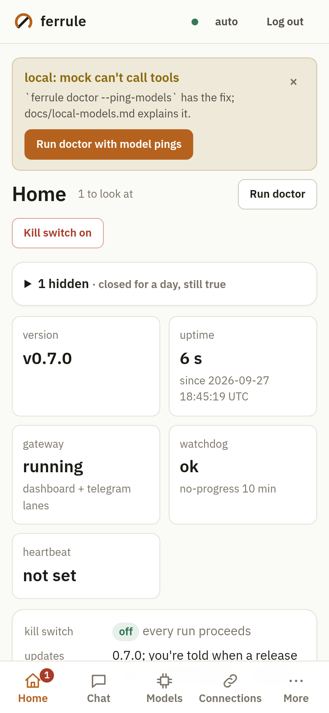
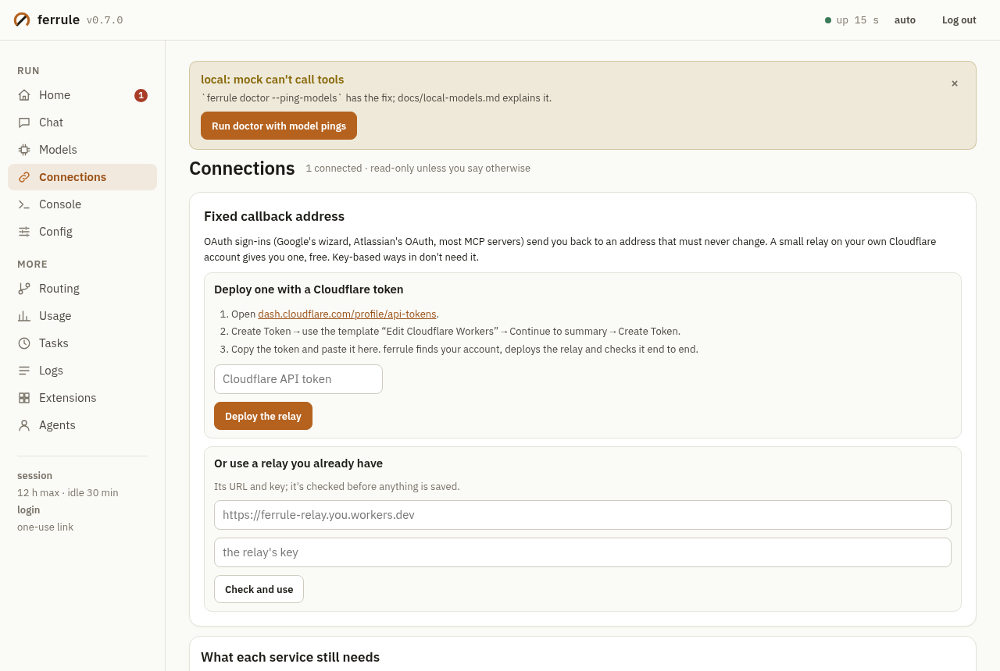

# The dashboard

One page for the whole app: what Ferrule is doing right now, what's
connected, which model is the default and whether it works, what it cost,
the scheduled tasks, the logs and the extensions. It's built for a phone,
and it works when the model doesn't: nothing on the way to the page, and
nothing on it, calls the model. The design, and the reasons behind it, are
in [m22-dashboard.md](m22-dashboard.md).

## Opening it

Send **`/dashboard`** to your bot in your private chat. The gateway answers
it itself, ahead of everything else, so it works mid-turn, with every model
down, with the kill switch on or a cap hit.

- By default (`[dashboard] remote = "tunnel"`), the reply is "Opening the
  dashboard's tunnel, the link follows in a moment", then an
  `https://….trycloudflare.com/login#…` link. Tap it.
- The tunnel needs `cloudflared`. Ferrule looks for it on `PATH`, then in
  the usual install dirs (`/usr/local/bin`, `/usr/bin`, `/opt/homebrew/bin`,
  `~/.local/bin`, …), then in `<data>/bin`. When it finds none, the first
  `/dashboard` downloads Cloudflare's official build for this machine from
  the latest [cloudflared release](https://github.com/cloudflare/cloudflared/releases)
  into `<data>/bin`, checks it against the SHA-256 digest GitHub publishes
  for that file, and only then runs it. The reply says so, and the link
  follows in about a minute. A download that doesn't match is thrown
  away. Nothing to install, and nothing to type on the server.
- With `[connections] cloudflared = "off"`, `remote = "off"`, or on a
  platform Cloudflare doesn't build for, you get a
  `http://127.0.0.1:<port>/login#…` link and the `ssh -L` command that
  reaches it from another machine.
- Sent from a group, the link goes to your private chat. From anyone but
  the owner, `/dashboard` gets no reply at all.

A link works **once**, for 10 minutes. Using it signs that browser in: the
session lasts 12 hours at most and ends after 30 minutes without a
request. The tunnel closes after 30 minutes with no session and no unused
link.

**`/dashboard off`** revokes every link and session and closes the tunnel.

**A restart keeps you signed in** (M24). Sessions are kept in
`<data>/private/dashboard/sessions.json` (hashes only, owner-only), and
the page comes back on the port it had, so a local or `ssh -L` tab keeps
working. A revoked session stays revoked, and a used link stays used. A
session through a tunnel can't survive, because the next tunnel has a new
name. When one was live, the gateway opens a new tunnel after the restart
and sends you a fresh link, at most once every 10 minutes.

At the machine (when Telegram itself is the problem):

```bash
ferrule dashboard link            # a one-time link to the running gateway's page
ferrule dashboard link --remote   # the same through a quick tunnel, open until Ctrl-C
ferrule dashboard off             # revoke every link and session
ferrule dashboard                 # a link, or the page served from here when no gateway runs
```

## What's on it

- **Health** comes first. The problems are on top, each with its fix: a
  failing default model (with a working one to switch to), the kill
  switch, a stuck turn, a channel that stopped polling, a used-up cap, a
  model without prices. Below that: uptime, version, channels, the
  running turns with **Stop**, the watchdog, the heartbeat (host only),
  the last restart, the kill switch with **Stop everything / Resume**,
  and today's spend against the caps.
- **Connections** (M20, M37): the one place for credentials. It has:
  - the fixed callback address (the relay);
  - a checklist with a next-step button on each line;
  - sign-ins still waiting, with **Cancel**;
  - what's connected, with **Test**, **Disconnect** and **Fix it**;
  - a tile per service, with its ways in, simplest first.

  See [connections.md](connections.md).
- **Models** (M21): the default, the fallbacks, the pins and outages;
  **Set default**, **Pin**, **Unpin**, **Test**, **Add**, **Remove**.
  - **Catalog**: OpenRouter's list and your providers' own `/models`,
    searchable and sortable by price, context or name, with prices per 1M
    tokens. It shows tool-capable models only unless you ask, because
    Ferrule's agent needs tools. `:free` models are flagged: they share a
    rate-limited pool and many have no tool endpoint. **Add**, **Add as
    default** (the real test runs first; a failing model is added but
    doesn't become the default), **Add as fallback**.
  - **Recommended**: a short curated list in tiers, checked against the
    live catalog (a model that's gone or can't call tools is hidden and
    named), with a monthly estimate from your last 30 days of tokens.
  - **Fill missing prices** writes catalog prices into the config with
    their source and date. It never overwrites a price you set by hand.
- **Usage** (the ledger): 1, 7 or 30 days; cost and tokens per day as
  bars; per model, task and chat; cache hit rate, latency, error and
  retry rates; the caps, with **Edit caps**. The per-model table is the one
  `ferrule ledger` prints.
- **Tasks**: schedule, next run, model, last runs; **Pause**, **Resume**,
  **Run now**, **Schedule**, **Model**, **Delete**.
- **Logs**: the audit log and the gateway's recent warnings and errors,
  filterable, paged and redacted. Never transcripts.
- **Extensions**: MCP servers (**Disable**, **Enable**, **Remove**),
  skills (**Disable**, **Enable**), the config's hooks, and this
  workspace's `.ferrule/hooks.toml` with its SHA-256 and **Trust this
  version** / **Untrust**. See [Editing from the page](#editing-from-the-page).
- **Agents** (running sub-agents): read-only.

The page polls only the section you're looking at (health every 3 s,
usage every 30 s, logs and extensions only when you ask), and stops while
the tab is hidden. A hand edit of the config, a CLI change or a
Telegram `/model` shows at the next poll.

Disconnect, delete, remove and the kill switch ask for a confirmation
first, and so do raising a cap, disabling an MCP server and trusting hooks.

User content (message previews, task names, log lines, skill
descriptions, the hooks file) sits in elements marked `dir="auto"`, so
Hebrew or Arabic reads right to left inside the left-to-right page, and
the log filter takes Hebrew as it is.

## The control room (M37)

M37 made the page the place you run your agent from. The design is in
[m37-control-room.md](m37-control-room.md).




- **Layout.** On a phone, a bottom bar holds Home, Chat, Models,
  Connections and More; the other sections open in a sheet under More.
  From 900 px wide, a sidebar lists every section. Light or dark follows
  the system, and the toggle at the top overrides it for this browser.
- **Notices** on Home each carry their fix buttons. **×** hides one for
  a day. Hidden ones stay listed under "N hidden", with when each comes
  back, **Show again** and **Show all again**. Doctor's findings are
  notices too.
- **Models.** The fallback chain and every place a model is named are
  selects fed by the catalog, not text fields. A model can be added
  together with its provider's key, and the key is tested first.
- **Chat** is your agent in its own session (`dashboard__owner`). Replies
  stream in, and buttons work as they do on Telegram. Approval questions
  from any chat are listed above it, with **Allow** and **Refuse**.
- **Console** runs `ferrule` commands, as at the machine. The line is
  split without a shell and parsed like the CLI's own, and it runs with
  its input closed. Completion comes from the CLI's own command tree.
  Commands that change something show their class. Destructive ones ask
  first. Commands that could run anything (and the ones that open a
  shell) are refused, with a pointer to where the page does the same
  thing. Every command is audited. **Every command, and where it lives
  on this page** lists all of them. There is no shell and no terminal on
  the page.
- **Config** shows the file with secrets as placeholders, and a typed
  form per section. **Check** gives the loader's own message and line.
  **Save** writes atomically and keeps `ferrule.toml.prev` for **Undo**.
  Fields that carry commands, gates, secret routing or who gets in can
  only change on the machine.
- **Everything works with every model down.** Nothing on the page calls
  a model, except Chat and the model tests you press.

**Fonts** are IBM Plex Sans (400 and 600), with Plex Sans Hebrew loaded
only for Hebrew text, and IBM Plex Mono 400. They're served from the
binary as woff2 with a one-year cache: about 129 KB in all, and about
60 KB for a page with no Hebrew. Their licence is at `/fonts/OFL.txt`.
Icons are inline SVG paths in the script. Type sizes are 13, 15, 17, 20,
24 and 30 px. Text written by you or the agent sits in `dir="auto"`
elements and is set with `textContent` only.

## What it never shows

Keys, tokens, the relay key, secrets-file values, the heartbeat URL's
path, URL paths in log lines, and message bodies beyond a redacted
80-character preview of a running turn. Every response also passes through
the same redactor as `/status`.

## Model prices from the command line

```bash
ferrule model catalog --search flash --tools   # prices per 1M, context, tools
ferrule model catalog --json
ferrule model recommend                        # the tiers, with a monthly estimate
ferrule model fill-prices                      # price every unpriced model from the catalog
```

`ferrule doctor` warns about each connected model without prices, since
the dollar caps can't see its spend.

## Evaluating a candidate model

Before switching models, you can see how one does on Ferrule's own
harness (M24). **Evaluate** is on every row of the Models table and the
catalog. Pick the tasks above it:

- the **smoke subset**: 4 quick tasks, one of each kind (the default);
- the **whole starter suite**: all 20.

The page first asks with an estimate: the tasks, the tokens and dollars
at the model's prices (configured, or else the catalog's), your budget,
and how the default did on the same tasks last time. The estimate is what
the suite's mock model uses on those tasks. A real model takes more turns,
often several times more, so treat it as a floor.

The eval runs in the background, one at a time, without slowing the
gateway, with progress and a **Cancel**. It runs under your caps like any
unattended run:

- the kill switch or a used-up day cap refuses it before anything is sent;
- its budget is the lower of the per-run caps and what's left of today's;
- with no cap at all, it uses `ferrule eval`'s own defaults ($5, 20M tokens);
- its calls count toward the day, under the tree `eval:<run id>`;
- a model that isn't connected runs through its provider for the eval
  only, and isn't added.

The result sits next to the default's last result on the same tasks. It's
saved like any `ferrule eval run` (`<data>/eval/<run id>/`), so `ferrule
eval report --run <id>` prints it later.

```bash
ferrule model eval openrouter/qwen/qwen3-coder              # smoke subset; asks first
ferrule model eval fast --suite starter --yes               # all 20, no question
```

The CLI prints the estimate and asks. Without a terminal it needs `--yes`.
It exits 3 when a cap stopped the run. It needs the starter suite from a
Ferrule checkout, looked up in this order: `[eval] suite`,
`$FERRULE_EVAL_SUITE`, `./evals/starter`, then the checkout the binary was
built from. It needs `python3` for the graders. An eval never starts the
dashboard or a tunnel.

## Editing from the page

The page, Telegram and the CLI run the same operations. Each one takes the
config lock, edits `ferrule.toml` in place (comments and order kept),
checks that the result still loads, writes it atomically and records an
audit entry with who did it (`dashboard`, `cli` or `telegram chat …`).
A running gateway picks the change up at once.

| What | Page | Telegram (owner) | CLI |
|---|---|---|---|
| Caps | Usage → Edit caps | `/caps`, `/caps usd_per_day 20` | `ferrule trust caps [--set KEY=VALUE…] [--yes]` |
| MCP server on/off | Extensions | `/mcp`, `/mcp off <name>` | `ferrule mcp disable\|enable <name>` |
| Remove an MCP server | Extensions | – | `ferrule mcp remove <name>` |
| Skill on/off | Extensions | `/skills`, `/skills off <name>` | `ferrule skills disable\|enable <name>` |
| Trust workspace hooks | Extensions | – (points to the page) | `ferrule hooks trust` / `untrust` |
| A task's schedule | Tasks → Schedule | – | `ferrule tasks schedule <id> "<cron>" [--tz Zone]` |
| A task's model | Tasks → Model | – | `ferrule tasks model <id> <ref>` |

- **Caps.** 0 turns a cap off. Lowering one needs no confirmation.
  Raising one or turning it off asks first: on the page, as `/caps … confirm`
  in Telegram, and with `--yes` (or a `y` at a terminal) in the CLI. The
  running hub enforces the new values from the next call.
- **MCP.** Disabling writes the name to `[mcp] disabled`. The server stays
  configured, and running agents stop it within seconds. A server the
  agent installed can be removed but not disabled.
- **Skills.** Disabling writes to `[skills] disabled`. The skill leaves the
  catalog from the next turn, since chats start fresh agents.
- **Hooks.** The page shows the file, its SHA-256 and, once a version has
  been trusted, a line diff against it. **Trust** sends the hash you were
  shown. If the file changed since then, it's refused and nothing is
  trusted. Trust is pinned to that hash: any later edit to the file needs
  trusting again. The trusted text is kept (0600) under
  `<data>/private/hooks-trusted/` for the next diff.
- **Tasks.** A schedule is checked before it's saved, and the next run
  moves at once. The built-in `ferrule-learn` task's schedule also goes
  to `[learning] schedule`/`timezone`, since that's what a restart reads.

## Settings

```toml
[dashboard]
enabled = true        # the gateway serves it on 127.0.0.1
port = 0              # 0: any free port
remote = "tunnel"     # "tunnel": /dashboard opens a cloudflared quick tunnel; "off": local only
idle_minutes = 30
session_hours = 12
link_minutes = 10

[models]
# Where prices come from when no connected provider is OpenRouter.
# Unset: OpenRouter's public list. "": none.
catalog_url = "https://openrouter.ai/api/v1/models"

[eval]
# The starter suite for Evaluate and `ferrule model eval` (an evals/starter directory).
suite = "/path/to/ferrule/evals/starter"
```

## Security in three lines

- The page listens on 127.0.0.1 only. The phone reaches it through a
  quick tunnel you open and close, and Cloudflare sees the (already
  redacted) traffic.
- The only way in is a one-use, 10-minute link sent to the owner's chat.
  It travels in the URL fragment, so no server logs it, and only its hash
  is stored.
- Sessions are HttpOnly, SameSite=Strict cookies bound to their host.
  Every change needs a CSRF header, a JSON body and a matching Origin.
  Unknown hosts are refused, which stops DNS rebinding.

## Smoke test

`scripts/dashboard-smoke.sh` (or `scripts/dashboard-smoke.ps1` on
Windows) walks the whole path in about 2 minutes, without an API key or a
bot token and without touching your own config or data:

```sh
scripts/dashboard-smoke.sh                        # builds a release binary first
FERRULE_BIN=~/.cargo/bin/ferrule scripts/dashboard-smoke.sh   # or uses yours
```

It starts the starter suite's mock model and a fake Telegram, runs
`ferrule gateway` on a temp config, and sends `/dashboard` from the
owner's chat. With the link it signs in, loads the page and
`/api/health`, and checks that the API refuses a request without the
cookie. It then fetches the live OpenRouter catalog once and closes with
`/dashboard off`, checking that the session is revoked. If `cloudflared` is
found, the config asks for a quick tunnel and the page and login go
through `trycloudflare.com`; if not, that step prints SKIP. Each step
prints PASS, FAIL or SKIP, and the script exits non-zero on any FAIL.
It needs Python 3 (standard library only); the driver is
`scripts/dashboard_smoke.py`.

## Browser check

`scripts/dashboard_browser_check.mjs` drives a real headless Chromium
against `ferrule gateway`, on a temp config with the mock model, a fake
Telegram and a local MCP server that takes a key. It needs Node 22 and no
packages. It signs in with the `/dashboard` link, then:

- hides a notice and finds it in the hidden list;
- picks a fallback model;
- connects the MCP server with a key and tests it;
- runs a console command;
- chats once;
- visits every section, failing on any script error or a stray
  `null`/`undefined` on the page.

CI runs it on Linux, macOS and Windows.

```sh
cargo build -p ferrule-cli
node scripts/dashboard_browser_check.mjs --bin target/debug/ferrule [--chromium PATH] [--shots docs/assets/m37]
```

`--shots` saves the screenshots of Home, Connections, Models, Chat and
Console at 390 and 1280 px.
